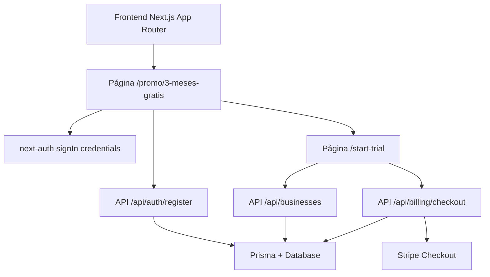
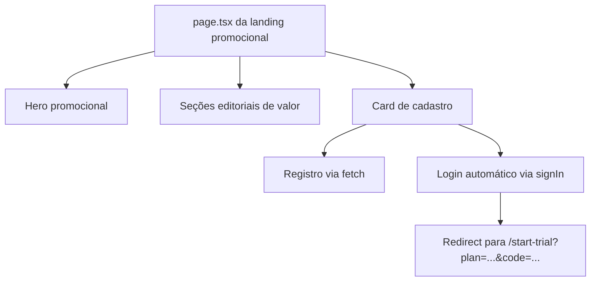

## 1. Desenho Da Arquitetura


## 2. Descrição Da Tecnologia
- Frontend: Next.js 16 + React 19 + TypeScript + Tailwind CSS
- Autenticação: `next-auth`
- Backend: Route Handlers do App Router
- Banco e persistência: Prisma + PostgreSQL
- Pagamentos: Stripe Checkout com Trial Invite já existente
- Animações: `framer-motion`, alinhado à landing principal
- Ícones: `lucide-react`

## 3. Definição Das Rotas
| Rota | Propósito |
|-------|---------|
| `/` | Landing principal já existente |
| `/promo/3-meses-gratis` | Landing promocional da campanha |
| `/register` | Cadastro genérico do produto |
| `/login` | Login de usuários existentes |
| `/start-trial` | Fluxo de criação de business e início do trial |

## 4. Definição Das APIs
### 4.1 Registro
```ts
type RegisterRequest = {
  name: string;
  email: string;
  password: string;
};

type RegisterResponse = {
  user: {
    id: string;
    email: string;
    name: string | null;
  };
};
```

### 4.2 Início Do Trial
```ts
type StartTrialRouteState = {
  plan: "starter" | "pro";
  code: string;
};
```

### 4.3 Checkout
```ts
type CheckoutRequest = {
  plan: "starter" | "pro";
  inviteCode?: string;
};

type CheckoutResponse = {
  url: string;
};
```

## 5. Arquitetura De Implementação


## 6. Modelo De Dados
### 6.1 Modelo Utilizado
Não há novo modelo de banco para esta entrega. A landing reutiliza:
- `User`
- `Business`
- `Subscription`
- `TrialInvite`
- `TrialInviteRedemption`

### 6.2 Regras E Persistência
- O código promocional deve entrar via query string ou variável pública de ambiente
- O código promocional pode ser mantido temporariamente no `localStorage` para garantir continuidade do fluxo
- A página não grava dados próprios; ela apenas orquestra o fluxo existente

## 7. Diretrizes Técnicas De UI
- Reaproveitar o mesmo tema visual da landing principal: fundo escuro, brilho azul/verde, painéis translúcidos e tipografia forte
- Evitar aparência de página “isolada” ou genérica
- Reusar quando possível os mesmos padrões de CTA, espaçamento e ritmo visual das seções já existentes em `src/components/Landing`
- O card de cadastro deve parecer parte da mesma família visual do hero atual
