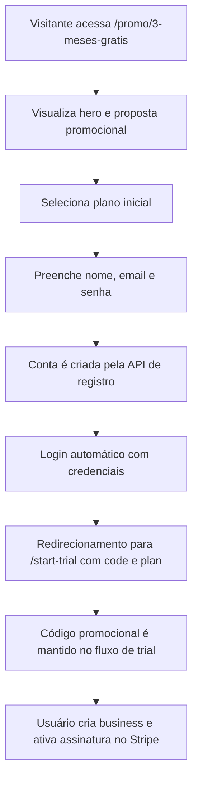

## 1. Visão Geral Do Produto
Landing promocional para campanha de aquisição oferecendo 3 meses grátis, com o mesmo tema visual da landing principal da Respondly.
- O objetivo é maximizar conversão de tráfego pago, social e outbound, conectando a mensagem promocional ao fluxo real de cadastro e ativação do trial.
- A página deve transmitir consistência com a marca atual, reforçar valor do produto e levar o usuário até o cadastro com o menor atrito possível.

## 2. Funcionalidades Principais

### 2.1 Papéis De Usuário
| Papel | Forma de acesso | Permissões principais |
|------|------------------|-----------------------|
| Visitante | Link direto da campanha | Visualizar oferta, selecionar plano, criar conta e seguir para ativação do trial |
| Usuário novo | Cadastro por email | Criar conta, autenticar automaticamente e seguir para `/start-trial` com código promocional |
| Usuário existente | Login | Acessar o fluxo com o código promocional já aplicado |

### 2.2 Módulos Da Funcionalidade
1. **Landing promocional**: hero promocional, prova de valor, benefícios, detalhes da oferta e cadastro embutido.
2. **Bloco de cadastro**: formulário de nome, email, senha e escolha de plano.
3. **Ponte para trial**: persistência do código promocional e redirecionamento para `/start-trial`.

### 2.3 Detalhamento Das Páginas
| Nome da página | Módulo | Descrição da funcionalidade |
|-----------|-------------|---------------------|
| Landing promo 3 meses | Hero promocional | Destaca a oferta de 3 meses grátis com o mesmo clima visual da landing principal |
| Landing promo 3 meses | Blocos de valor | Explica benefícios, funcionamento da automação e passos de ativação |
| Landing promo 3 meses | Cadastro | Permite criar conta sem sair da página |
| Landing promo 3 meses | Seleção de plano | Permite iniciar com `starter` ou `pro` antes do redirect |
| Landing promo 3 meses | CTA para login | Encaminha usuário existente para login mantendo `next`, `code` e `plan` |

## 3. Fluxo Principal
O visitante chega pela campanha, visualiza a oferta, escolhe o plano, cria a conta e é autenticado automaticamente. Em seguida, é redirecionado para `/start-trial` com o código promocional de 90 dias já aplicado para concluir a criação do business e a ativação no Stripe.

## 4. Design Da Interface
### 4.1 Estilo Visual
- Cores principais: fundo preto profundo, superfícies `zinc` translúcidas, acentos azul e verde como na landing principal
- Botões: arredondados, glow sutil, CTA primário brilhante e CTA secundário com borda translúcida
- Tipografia: manter o mesmo sistema visual da landing principal, com heading dramático, texto editorial e captions em uppercase
- Layout: desktop-first, hero amplo com composição em duas colunas e painéis translúcidos
- Ícones: `lucide-react`, discretos e consistentes com o visual premium da marca

### 4.2 Visão Das Seções
| Nome da página | Módulo | Elementos de UI |
|-----------|-------------|-------------|
| Landing promo 3 meses | Hero | Badge promocional, título forte, subtítulo, CTAs e painel de destaque |
| Landing promo 3 meses | Prova de valor | Cartões escuros com borda suave, gradientes, números e microcopy |
| Landing promo 3 meses | Oferta | Destaque para "3 meses grátis", código promocional e observação de cartão obrigatório |
| Landing promo 3 meses | Cadastro | Card escuro com blur, inputs consistentes com o produto e seletor de plano |
| Landing promo 3 meses | CTA final | Reforço da oferta com continuidade visual da home |

### 4.3 Responsividade
- Abordagem desktop-first com adaptação fluida para tablet e mobile
- Em telas menores, a composição deve virar pilha vertical sem perder a hierarquia
- O bloco de cadastro deve continuar visível cedo na página, sem depender de scroll excessivo
